# Jenkins
## Configure Jenkins
In your **Cloud Shell (ssh)**  
Display and copy the Jenkins admin password
```
sudo cat /var/lib/jenkins/secrets/initialAdminPassword
```

**In your browser**  
Open a new tab and go to `https://<YourPublicIP>:8080`  
   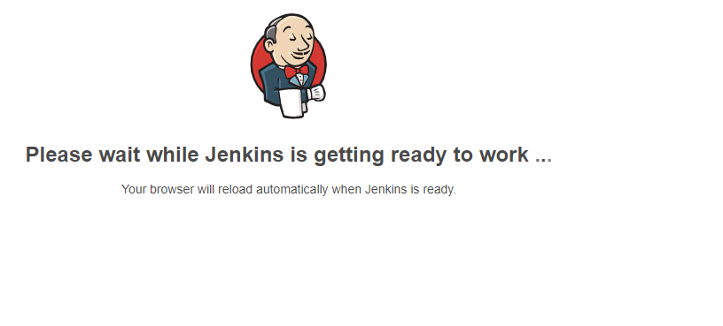  
Log in with the above password
   

1. Click Install suggested plugins  
     
     
1. Populate the fields to create an admin user
1. Click Save and continue  
   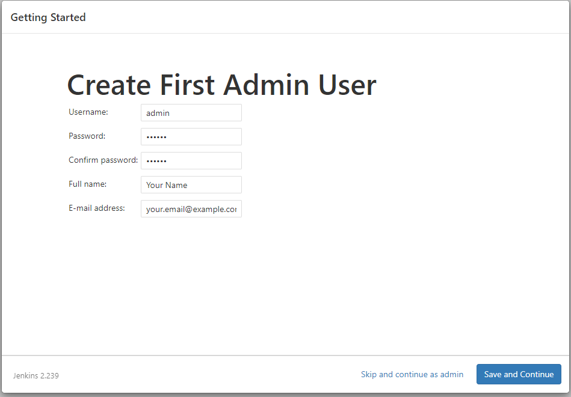
1. Click Save and Finish  
   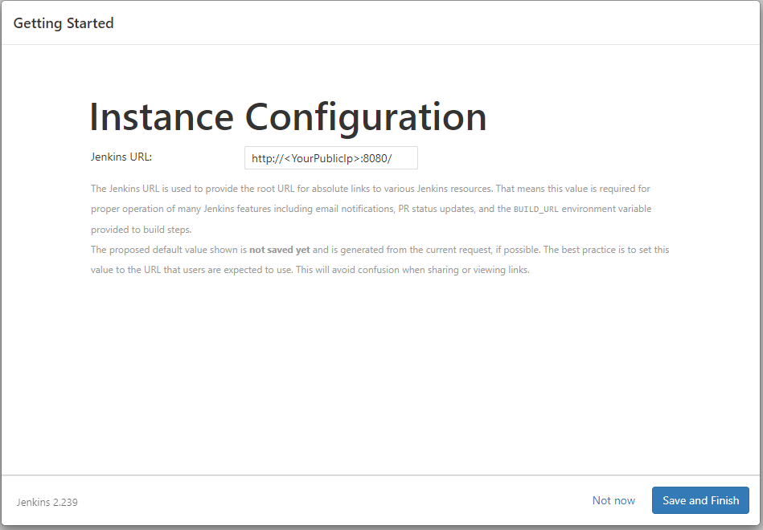
1. Click Start using Jenkins  
   
1. Click 'Manage Jenkins'  
   
1. Click 'Manage Plugins'  
   
1. Click 'Available' tab
1. In the search box, enter 'utplsql'
1. Locate 'utPLSQL' and check the Install checkbox.
     
1. In the search box, enter 'Cobertura'  
1. Locate 'Cobertura' and check the Install checkbox.  
1. Click Install without restart.  
   
1. Check 'Restart Jenkins when installation is complete and no jobs are running'  
   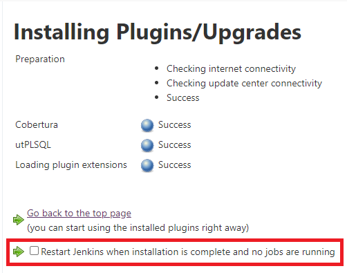  
1. Wait for Jenkins to restart  
   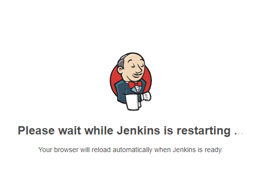  
1. Sign in as your admin user  
   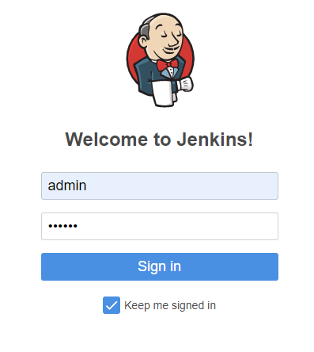  
1. Click 'New Item'  
     
1. Enter a name for your project
1. Select 'Freestyle Project'
1. Click [OK]  
   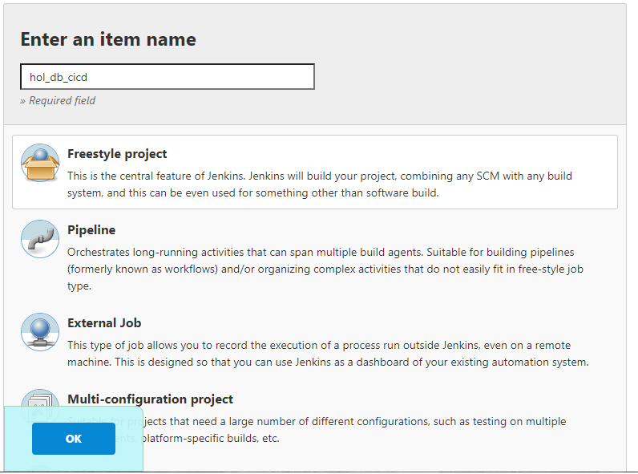  

## Setup Your Project
1. Source Code Management
    1. Select Git
    1. In Repository URL enter the https URL from your fork of the repository  
    **Note:** Using the https url (without credentials) instead of the ssh url will allow Jenkins read-only access to your repository.  This is all you need for this lab.  
     
1. Build Triggers
    1. Check "GitHub hook trigger for GITScm polling"  
     
   This will set your Jenkins build to listen for the webhook you created in your GitHub repository.  
   Whenever you push a change to your repository it will automatically trigger a build.
1. Build Environment 
    1. Check "Delete workspace before build starts"
    1. Check "Use secret text(s) or file(s)"  
     
   You will now create environment variables that will be bound to the database user & password for your hol_test schema.  The password will be kept in the Jenkins credentials manager and it will be obfuscated in the logs whenever it is used. 
1. Bindings
    1. Click the Add button
    1. Select "Username and password (separated)"  
          
    1. In "Username Variable" enter "username"
    1. In "Password Variable" enter "password"
    1. Select "Specific Credentials"
    1. Click the Add button.
    1. Select Jenkins.  
        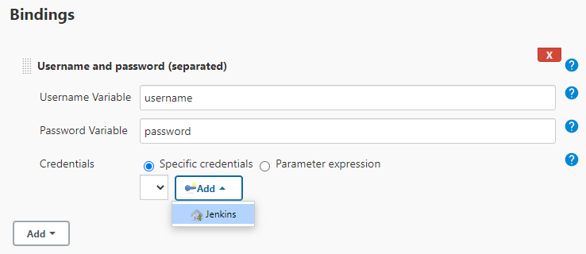  
    1. Set Kind to "Username with password"
    1. Set Username to "hol_test"
    1. Set Password to "HandsOnLabUser1" (if you changed the password when you created the schema, use that password)
    1. Click Add  
          
1. Build
    1. Click Add build step
    1. Select Execute shell  
          
    1. Enter the following in the Command field
        ```
        DB_URL="MyAtpDb_TP"

        cd liquibase

        /opt/liquibase/liquibase --changeLogFile=master.json \
        --url=jdbc:oracle:thin:@${DB_URL}?TNS_ADMIN=/opt/oracle/wallet \
        --username=${username} \
        --password=${password} \
        --classpath=/opt/oracle/ojdbc8.jar \
        --contexts='test' \
        update
        ```  
          
    1. Click 'Add build step'
    1. Select Execute shell  
          
    1. Enter the following in the Command field
        ```
        DB_URL="MyAtpDb_TP"

        /opt/utPLSQL-cli/bin/utplsql run ${username}/${password}@${DB_URL}?TNS_ADMIN=/opt/oracle/wallet \
        -f=ut_coverage_cobertura_reporter -o=coverage.xml \
        -f=ut_xunit_reporter -o=xunit_test_results.xml
        ```  
          
    1. Click 'Add build step'
    1. Select Execute shell  
          
    1. Enter the following in the Command field
        ```
        DB_URL="MyAtpDb_TP"

        cd liquibase

        /opt/liquibase/liquibase --changeLogFile=master.json \
        --url=jdbc:oracle:thin:@${DB_URL}?TNS_ADMIN=/opt/oracle/wallet \
        --username=${username} \
        --password=${password} \
        --classpath=/opt/oracle/ojdbc8.jar \
         DBDoc docs

        zip -rq liquibaseDocs.zip docs
        ```  
          
1. Post-build Actions
    1. Click 'Add post-build action'
    1. Select 'Archive the artifacts'  
        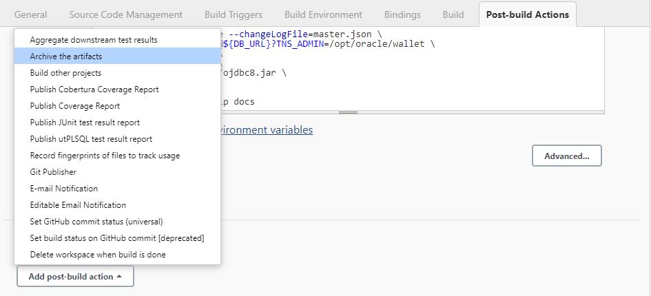  
    1. In 'Files to archive' enter  
        ```
        coverage.xml, xunit_test_results.xml, liquibase/liquibaseDocs.zip
        ```  
       (Ignore any message about the files not existing)  
          
    1. Click 'Add post-build action'
    1. Select 'Publish Cobertura Coverage Report'  
        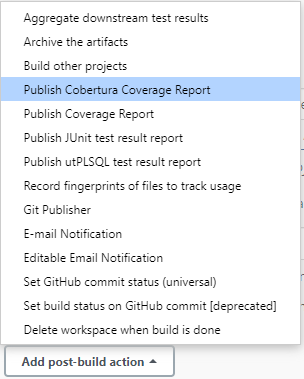  
    1. In 'Cobertura xml report pattern' enter `coverage.xml`  
          
    1. Click 'Add post-build action'
    1. Select 'Publish JUnit test result report'  
          
    1. In 'Test report XMLs' enter `xunit_test_results.xml`  
        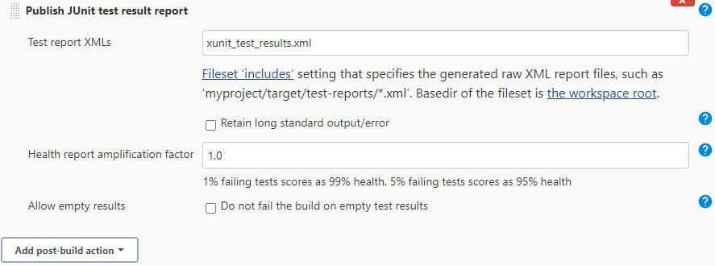  

1. Click 'Save'  
          

## Summary
Your new project will do the following when you manually run it or when it is triggered by the GitHub webhook.
1. Delete the previous workspace (if one exists)
1. Checkout your GitHub repository
1. Use Liquibase to make any database changes (covered in the Liquibase section)
1. Use utPLSQL to unit test your PL/SQL function and generate a test coverage report (covered in the utPLSQL section)
1. Use Liquibase to generate documentation for your database (covered in the Liquibase section)
1. Archive the test results, coverage report and database documents
1. Publish the coverage report
1. Publish the unit test results

You may run a build if you'd like, but there's not much for it to do until you work through the other sections of the lab.

Keep this browser tab open so you can come back and check the status of your builds as they run.

## Goto the [Liquibase](Liquibase.md) section