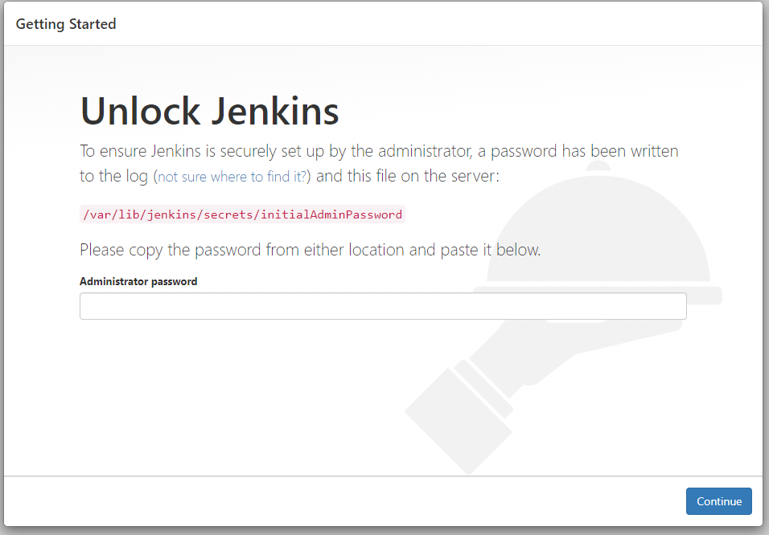
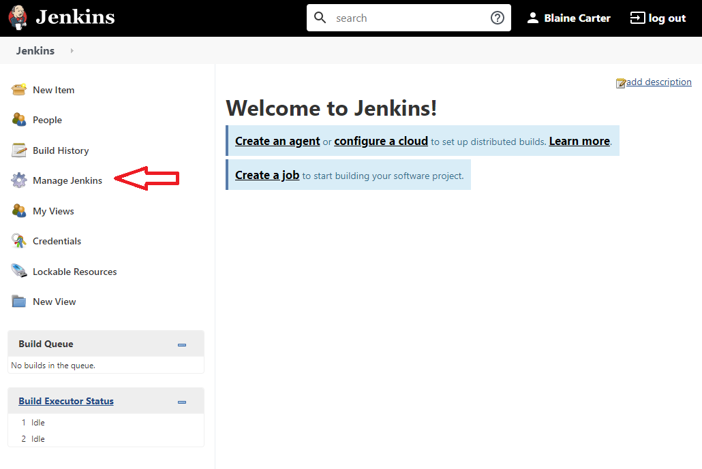
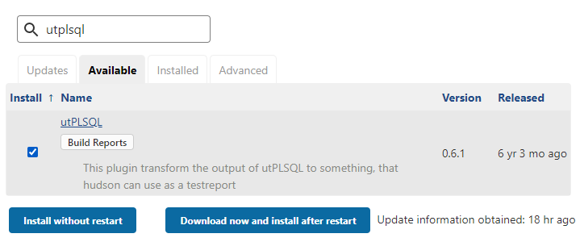
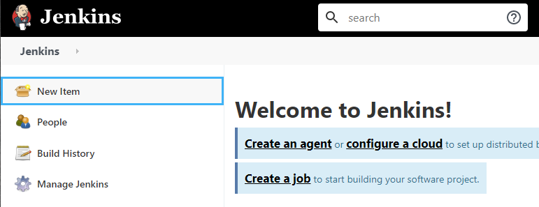
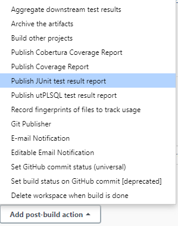
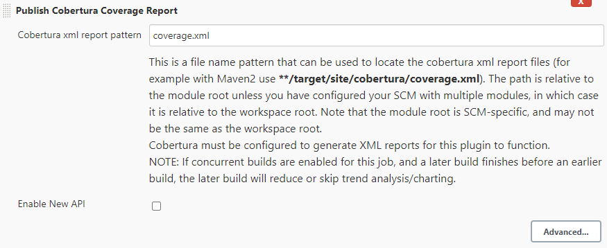
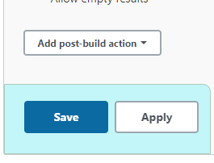

# Jenkins
## Configure Jenkins
In the **Cloud Shell (ssh)**  
Display and copy the Jenkins admin password
```
sudo cat /var/lib/jenkins/secrets/initialAdminPassword
```

**In your browser**  
Open a new tab and go to ```https://<yourComputeIP>:8080```  
   
Log in with the above password
   

1. Install suggested  
     
   
1. admin/Tester
1. Name
1. Email
1. Save and continue  
   
1. Save and Finish  
   
1. Start using Jenkins  
   
1. Click 'Manage Jenkins'  
   
1. Click 'Manage Plugins'
   
1. Click 'Available' tab
1. In the search box, enter 'utplsql'
1. Locate 'utPLSQL plugin' and check the Install checkbox.
     
1. In the search box, enter 'Cobertura'  
1. Locate 'Cobertura' and check the Install checkbox.  
1. Click Install without restart.  
   
1. Check 'Restart Jenkins when installation is complete and no jobs are running'  
     
1. Sign in as admin/Tester  
     
1. Click 'New Item'  
     
1. Enter a name for your project
1. Select 'Freestyle Project'
1. Click [OK]  
     

## Setup Your Project
1. Source Code Management
    1. Select Git
    1. In Repository URL enter the https URL you copied from your fork of the repo
    # Either include rsa key or put note about read only https  
     
1. Build Triggers
    1. Check "GitHub hook trigger for GITScm polling"  
     
1. Build Environment 
    1. Check "Delete workspace before build starts"
    1. Check "Use secret text(s) or file(s)"  
     
1. Bindings
    1. Click Add button
    1. Select "Username and password (separated)"  
          
    1. In "Username Variable" enter "username"
    1. In "Password Variable" enter "password"
    1. Select "Specific Credentials"
    1. Click the Add button.
    1. Select Jenkins.  
          
    1. Set Kind to "Username with password"
    1. Set Username to "hol_test"
    1. Set Password to "HandsOnLabUser1" (if you changed the password when you created the schema, use that password)
    1. Click Add  
          
1. Build
    1. Click Add build step
    1. Select Execute shell  
          
    1. Enter the following in the Command field
        ```
        DB_URL="MyAtpDb_TP"

        cd liquibase

        /opt/liquibase/liquibase --changeLogFile=master.json \
        --url=jdbc:oracle:thin:@${DB_URL}?TNS_ADMIN=/opt/oracle/wallet \
        --username=${username} \
        --password=${password} \
        --classpath=/opt/oracle/ojdbc8.jar \
        --contexts='!test' \
        update
        ```  
          
    1. Click 'Add build step'
    1. Select Execute shell  
          
    1. Enter the following in the Command field
        ```
        DB_URL="MyAtpDb_TP"

        /opt/utPLSQL-cli/bin/utplsql run ${username}/${password}@${DB_URL}?TNS_ADMIN=/opt/oracle/wallet \
        -f=ut_coverage_cobertura_reporter -o=coverage.xml \
        -f=ut_xunit_reporter -o=xunit_test_results.xml
        ```  
          
    1. Click 'Add build step'
    1. Select Execute shell  
          
    1. Enter the following in the Command field
        ```
        DB_URL="MyAtpDb_TP"

        cd liquibase

        /opt/liquibase/liquibase --changeLogFile=master.json \
        --url=jdbc:oracle:thin:@${DB_URL}?TNS_ADMIN=/opt/oracle/wallet \
        --username=${username} \
        --password=${password} \
        --classpath=/opt/oracle/ojdbc8.jar \
         DBDoc docs

        zip -rq liquibaseDocs.zip docs
        ```  
          
1. Post-build Actions
    1. Click 'Add post-build action'
    1. Select 'Archive the artifacts'  
          
    1. In 'Files to archive' enter ```coverage.xml, xunit_test_results.xml, liquibase/liquibaseDocs.zip```  
       (Ignore any message about the files not existing)  
          
    1. Click 'Add post-build action'
    1. Select 'Publish JUnit test result report'  
          
    1. In 'Test report XMLs' enter ```xunit_test_results.xml```  
          
    1. Click 'Add post-build action'
    1. Select 'Publish Cobertura Coverage Report'  
          
    1. In 'Cobertura xml report pattern' enter ```coverage.xml```  
          

1. Click 'Save'  
          
