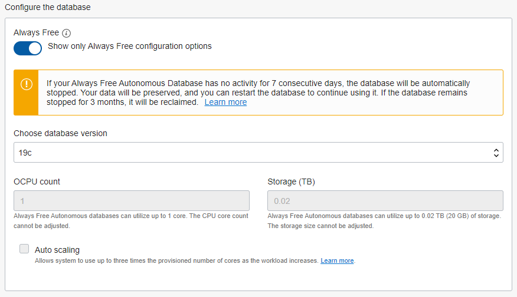
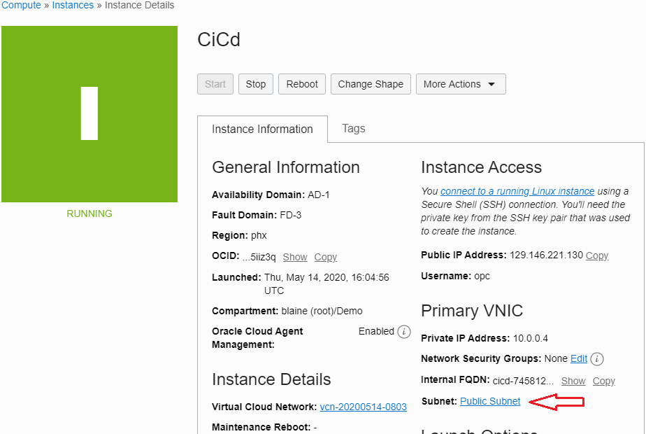
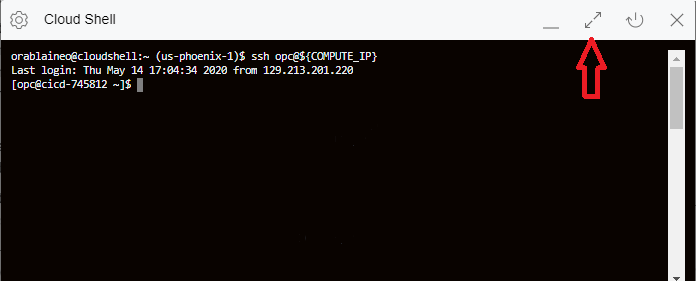

# CI/CD Tools for Database Developers
## Before You Begin

This 3.5-hour lab walks you through the steps to ...

### Background
Enter background information here..

Next paragraph of background information
* List item 1.
* List item 2.
* List item 3.

### What Do You Need?

* Internet Browser
* Oracle Cloud Account
* GitHub account

## Create an Oracle Always-Free Cloud Account
You can setup an Always-Free account.

1. Go to https://www.oracle.com/cloud/free/
2. Click "Start for free"
3. Populate the forms and create an account.
4. Once your account is created, log in and go to the dashboard  
https://www.oracle.com/cloud/sign-in.html
   

## Create a compartment.
https://docs.cloud.oracle.com/iaas/Content/Identity/Tasks/managingcompartments.htm
1. Click the menu icon in the upper left corner.
1. Scroll to the bottom, under Identity, click "Compartments".
   
1. Click "Create Compartment".
   
1. Populate the Name and Description.
1. Leave the parent compartment set to (root).
1. Click "Create Compartment"
   
1. Click the "Oracle Cloud" logo to return to the dashboard.

## Create an ATP instance
1. Click "Create an ATP database" in the Autonomous Transaction Processing box.
   
1. Choose your new compartment.
1. Enter a Display name, or keep the default.
1. Enter a Database name, or keep the default.
1. Make sure "Transaction Processing" is selected.
1. Make sure "Shared Infrastructure" is selected.
   
1. Scroll down to "Create administrator credentials".  Enter and confirm the ADMIN password.
1. Scroll to the bottom and click "Create Autonomous Database".
   
   You will receive an email when your new ATP Database instance has been provisioned.
1. Locate your new database's OCID and click Copy.
   

## Cloud Shell
Click on the Cloud Shell icon.  
  
This will open a preconfigured VM that we will use to setup our project.

Once the Cloud Shell is running, create and environment variable for your Database OCID you copied above.

```
export DB_OCID=<pasteYourOCIDhere>
```


Once your ATP Database status is Available (the yellow box turns green) you can download the security wallet inside the Cloud Shell using the pre-configured OCI-CLI.

You should change the password value in this command to something more secure.  
This password is for the .zip file and not your database.

```
oci db autonomous-database generate-wallet --autonomous-database-id ${DB_OCID} --password Pw4ZipFile --file ~/Wallet_MyAtpDb.zip
```

Later, after everything is setup, you will use SQLDeveloper Web to access your database.  
Run the following command and save the URL for later.
```
oci db autonomous-database get --autonomous-database-id $DB_OCID --query 'data."connection-urls"."sql-dev-web-url"' --raw-output
```
Click the "Oracle Cloud" logo to return to the dashboard.
   
## Create a Compute instance
1. Click "Create a VM instance" in the Compute box.
   
1. Populate the instance name or keep the default.
   
1. Scroll down the the "Add SSH keys" section.
1. Select "Paste SSH keys".
1. Generate a new RSA key pair in the Cloud Shell.
   ```
   ssh-keygen -t rsa -N "" -b 2048 -C "cloud_shell" -f ~/.ssh/id_rsa
   ```
1. Display the public key, copy it then paste it in the SSH KEYS box.
   ```
   cat ~/.ssh/id_rsa.pub
   ```
   
   (you may also want to save a copy of the private key ~/.ssh/id_rsa on your local machine.)
1. Click "Create".
1. Once the Compute instance is Running, locate the Public IP Address and click Copy.
1. In your Cloud Shell, create an environment variable to store the IP.
   ```
   export COMPUTE_IP=<yourIP>
   ```
   
1. Next, you will need to open port 8080.
1. Click "Public Subnet"
   
1. Click the Security List name.
   
1. Click Add Ingress Rule.
   
1. In the SOURCE CIDR box enter
   ```
   0.0.0.0/0
   ```
1. In the DESTINATION PORT RANGE box enter
   ```
   8080
   ```
1. Click Add Ingress Rule.
   

   **Be Aware**  
   **This will open port 8080 for any instance using the default security list**  

1. In the Cloud Shell, use SCP to send the security wallet (downloaded earlier) to new Compute instance.
   ```
   scp Wallet_MyAtpDb.zip opc@${COMPUTE_IP}:/home/opc/
   ```
   

1. Maximize the Cloud Shell.
1. Use SSH to access your Compute instance from the Cloud Shell
   ```
   ssh opc@${COMPUTE_IP}
   ```
   

## Install software
### Update your instance
```
sudo yum update -y
```
This may take a few minutes since this is a new instance.  Please be patient.

### GitHub
While the update is running goto GitHub.com and fork the repository
1. steps
1. In the repository click Settings
1. Click Webhooks
1. Click the Add webhook button
1. Use your Compute instance public IP to populate the Payload URL
   ```
   http://<YourPublicIP>:8080/github-webhook/
   ```
1. Click the Add webhook button.

### Setup Wallet

```
sudo mkdir /opt/oracle
sudo mkdir /opt/oracle/wallet
sudo mv Wallet_MyAtpDb.zip /opt/oracle/wallet/
sudo unzip /opt/oracle/wallet/Wallet_MyAtpDb.zip -d /opt/oracle/wallet/
```

### Edit the wallet/ojdbc.properties file to simplify the database connection.
```
sudo nano /opt/oracle/wallet/ojdbc.properties
```
1. Comment line 2
1. Un-comment the last 4 lines that start with '#javax.net.ssl'
1. Replace <password_from_console> with the password you used when you downloaded the wallet .zip file.
   ```
   # Connection property while using Oracle wallets.
   # oracle.net.wallet_location=(SOURCE=(METHOD=FILE)(METHOD_DATA=(DIRECTORY=${TNS_ADMIN})))
   # FOLLOW THESE STEPS FOR USING JKS
   # (1) Uncomment the following properties to use JKS.
   # (2) Comment out the oracle.net.wallet_location property above
   # (3) Set the correct password for both trustStorePassword and keyStorePassword.
   # It's the password you specified when downloading the wallet from OCI Console or the Service Console.
   javax.net.ssl.trustStore=${TNS_ADMIN}/truststore.jks
   javax.net.ssl.trustStorePassword=Pw4ZipFile
   javax.net.ssl.keyStore=${TNS_ADMIN}/keystore.jks
   javax.net.ssl.keyStorePassword=Pw4ZipFile
   ```
1. Ctrl-X
1. Y
1. Enter

### Download the Oracle Database Driver ojdbc8.jar
```
sudo wget https://repo1.maven.org/maven2/com/oracle/ojdbc/ojdbc8/19.3.0.0/ojdbc8-19.3.0.0.jar -O /opt/oracle/ojdbc8.jar
```

### Install Git
```
sudo yum install -y git
git --version
```

### Install Java 8
```
sudo yum install -y --enablerepo=ol7_ociyum_config oci-included-release-el7
sudo yum install -y jdk1.8
java -version
```

### Install SQLcl
```
sudo yum install -y sqlcl
alias sql="/opt/oracle/sqlcl/bin/sql"
sql -v
```

### Create the database schema with SQLcl
1. In the Cloud Shell ssh session.
1. Run SQLcl without logging in.
   ```
   sql /nolog
   ```
1. Set the location of your wallet file.
   ```
   set cloudconfig /opt/oracle/wallet/Wallet_MyAtpDb.zip
   ```
1. Connect as the Admin user.  
   admin/[your adminPassword]@[your DB name]_tp
   ```
   connect admin/notMyPassword@MyAtpDb_TP
   ```
1. Use the following SQL commands to create the new schema.

```
CREATE USER hol_dev IDENTIFIED BY HandsOnLabUser1;
ALTER USER hol_dev TEMPORARY TABLESPACE temp;

GRANT CREATE SESSION, RESOURCE, UNLIMITED TABLESPACE TO hol_dev;

GRANT CREATE TABLE,
CREATE VIEW,
CREATE SEQUENCE,
CREATE PROCEDURE,
CREATE TYPE,
CREATE SYNONYM
TO hol_dev;

BEGIN
 ords_admin.enable_schema(
  p_enabled => TRUE,
  p_schema => 'hol_dev',
  p_url_mapping_type => 'BASE_PATH',
  p_url_mapping_pattern => 'hol_dev',
  p_auto_rest_auth => NULL
 );
 commit;
END;
/

CREATE USER hol_prod IDENTIFIED BY HandsOnLabUser1;
ALTER USER hol_prod TEMPORARY TABLESPACE temp;

GRANT CREATE SESSION, RESOURCE, UNLIMITED TABLESPACE TO hol_prod;

GRANT CREATE TABLE,
CREATE VIEW,
CREATE SEQUENCE,
CREATE PROCEDURE,
CREATE TYPE,
CREATE SYNONYM
TO hol_prod;

BEGIN
 ords_admin.enable_schema(
  p_enabled => TRUE,
  p_schema => 'hol_prod',
  p_url_mapping_type => 'BASE_PATH',
  p_url_mapping_pattern => 'hol_prod',
  p_auto_rest_auth => NULL
 );
 commit;
END;
/

-- Add table lb_groups
CREATE TABLE HOL_PROD.customers (id INTEGER GENERATED BY DEFAULT AS IDENTITY NOT NULL,
                                 email VARCHAR2(255),
                                 name VARCHAR2(255) NOT NULL,
                                 company VARCHAR2(255) NOT NULL,
                                 CONSTRAINT customers_pk PRIMARY KEY (id),
                                 CONSTRAINT customers_email_uk UNIQUE (email));

-- Create Order_Statuses table
CREATE TABLE HOL_PROD.order_statuses (status VARCHAR2(10) NOT NULL,
                                      description VARCHAR2(255),
                                      CONSTRAINT order_statuses_pk PRIMARY KEY (status));

-- Add table lb_groups
CREATE TABLE HOL_PROD.orders (id INTEGER GENERATED BY DEFAULT AS IDENTITY NOT NULL,
                              order_datetime TIMESTAMP DEFAULT CURRENT_TIMESTAMP NOT NULL,
                              customer_id INTEGER NOT NULL,
                              order_status VARCHAR2(10) NOT NULL,
                              CONSTRAINT orders_pk PRIMARY KEY (id),
                              CONSTRAINT orders_customer_id_fk FOREIGN KEY (customer_id) REFERENCES HOL_PROD.CUSTOMERS(id),
                              CONSTRAINT order_status_fk FOREIGN KEY (order_status) REFERENCES HOL_PROD.order_statuses (status));

-- Load Order_Statuses data
INSERT INTO HOL_PROD.order_statuses (status, description) VALUES ('New', 'Still being created');

INSERT INTO HOL_PROD.order_statuses (status, description) VALUES ('Submitted', 'Awaiting payment');

INSERT INTO HOL_PROD.order_statuses (status, description) VALUES ('Shipped', 'Has been sent');

INSERT INTO HOL_PROD.order_statuses (status, description) VALUES ('Complete', 'Has been delivered');

-- Create Database Lock Table
CREATE TABLE HOL_PROD.DATABASECHANGELOGLOCK (ID INTEGER NOT NULL,
                                             LOCKED NUMBER(1) NOT NULL,
                                             LOCKGRANTED TIMESTAMP,
                                             LOCKEDBY VARCHAR2(255),
                                             CONSTRAINT PK_DATABASECHANGELOGLOCK PRIMARY KEY (ID));

-- Create Database Change Log Table
CREATE TABLE HOL_PROD.DATABASECHANGELOG (ID VARCHAR2(255) NOT NULL,
                                         AUTHOR VARCHAR2(255) NOT NULL,
                                         FILENAME VARCHAR2(255) NOT NULL,
                                         DATEEXECUTED TIMESTAMP NOT NULL,
                                         ORDEREXECUTED INTEGER NOT NULL,
                                         EXECTYPE VARCHAR2(10) NOT NULL,
                                         MD5SUM VARCHAR2(35),
                                         DESCRIPTION VARCHAR2(255),
                                         COMMENTS VARCHAR2(255),
                                         TAG VARCHAR2(255),
                                         LIQUIBASE VARCHAR2(20),
                                         CONTEXTS VARCHAR2(255),
                                         LABELS VARCHAR2(255),
                                         DEPLOYMENT_ID VARCHAR2(10));

exit;
```
## Open a new browser tab and go to the SQLDeveloper Web URL you saved earlier.
     

Sign in using the schema and password you just created.
   

### Install Liquibase
```
wget https://github.com/liquibase/liquibase/releases/download/liquibase-parent-3.6.3/liquibase-3.6.3-bin.tar.gz
sudo mkdir /opt/liquibase
sudo tar xvzf liquibase-3.6.3-bin.tar.gz -C /opt/liquibase/
echo 'export PATH=$PATH:/opt/liquibase' >> ~/.bashrc
source ~/.bashrc
liquibase --version
```

### Install Jenkins
```
sudo wget -O /etc/yum.repos.d/jenkins.repo https://pkg.jenkins.io/redhat/jenkins.repo
sudo rpm --import https://pkg.jenkins.io/redhat/jenkins.io.key

sudo yum install -y jenkins

sudo systemctl start jenkins
sudo systemctl status jenkins
sudo systemctl enable jenkins
```

### Open port 8080 in the internal firewall
```
sudo firewall-cmd --permanent --zone=public --add-port=8080/tcp
sudo firewall-cmd --permanent --zone=public --add-port=8000/tcp
sudo firewall-cmd --reload
```

## Goto Jenkins section


(30 - 45 minutes)
## Goto Liquibase section

# TODO

# utPLSQL
### Install utPLSQL
### Install utPlsql-cli https://github.com/utPLSQL/utPLSQL-cli
### Compile package
### Create a test package
### Create a passing test
### Run tests in SQLcl
### Create a failing test
### Run tests
### Fix test -rerun
### Create a test for a new package / procedure
### Run all tests
### Run just tests for new p/p
### Create the new package / procedure
### Run all tests

## integrate with Jenkins
### http://utplsql.org/utPLSQL/v3.0.0/userguide/reporters.html

## Ci/Cd
### Set Jenkins to run on repo change
### Clone repo
### Add LB changeset - new table

### Add PL/SQL Package
Create a file liquibase/runOnChange/changelog-admin-pkg.json
Create a file Code/admin.pkg
git add .
git commit -m "added admin package"

### Create Utplsql test for new procedure
### Create new procedure
### Add LB changeset for new procedure
### Git commit/push
### check Jenkins output


## Section 1 title
Section 1 opening paragraph.

One line with code example `HelloWorld.java`.

1. Ordered list item 1.
2. Ordered list item 2 with image and link to the text description below. The `sample1.txt` file must be added to the `files` folder.

    

3. Ordered list item 3 with the same image but no link to the text description below.

    

4. Example with inline navigation icon  click **Navigation**.

5. One example with bold **text**.

   If you add another paragraph, add 3 spaces before the line.

Section conclusion can come here.

## Section 2 title

1. List item 1.

2. List item 2.

    ```
    Adding code examples
	Indentation is important for the code example to appear inside the step
    Multiple lines of code
	<copy>Enclose the text you want to copy in &lt;copy&gt;&lt;/copy&gt;.</copy>
    ```

3. List item 3. To add a video, follow the following format:

	```
	<copy>[](youtube:&lt;video_id&gt;)</copy>
	For example:
	[](youtube:zNKxJjkq0Pw)
    ```

    [](youtube:zNKxJjkq0Pw)

Conclusion of section 2 here.

## Want to Learn More?

* [URL text 1](http://docs.oracle.com)
* [URL text 2](http://docs.oracle.com)

## Acknowledgements
* **Author** - <Name, Title, Group>
* **Adapted for Cloud by** -  <Name, Group> -- optional
* **Last Updated By/Date** - <Name, Group, Month Year>
* **Workshop (or Lab) Expiry Date** - <Month Year> -- optional


# Archive

## Download Credentials
1. Click the menu icon in the upper left corner.
2. Click "Autonomous Transaction Processing".
3. Change to your compartment.
4. Locate your new ATP instance and click the menu option. (Three dots on the right side of the row)
5. Click "Service Console"
6. Click "Administration"
7. Click "Download Client Credentials (Wallet)"
8. Set a password that will be used to access the zip file.
9. Click "Download" and save the .zip file to /wallet.
10. Extract the .zip file into the /wallet directory.
11. Edit /wallet/ojdbc.properties
12. Set password 2 places.
13. Comment line 2.
14. Un-Comment last 4 lines.
***Warning*** this is a credentials file that will be used when connecting to your database. ***Keep it Secure***.


# Archive


https://docs.cloud.oracle.com/iaas/Content/Compute/Tasks/accessinginstance.htm

### Connecting to Your Linux Instance from a Unix-style System

$ ssh –i <private_key> opc@<public-ip-address>
<private_key> is the full path and name of the file that contains the private key associated with the instance you want to access.

<public-ip-address> is your instance IP address that you retrieved from the Console.


### Connecting to Your Linux Instance from a Windows System
Open putty.exe.

In the Category pane, expand Window, and then select Translation.

In the Remote character set drop-down list, select UTF-8. The default locale setting on Linux-based instances is UTF-8, and this configures PuTTY to use the same locale.

In the Category pane, select Session and enter the following:

Host Name (or IP address):

opc@<public-ip-address>

<username> is the default name for the instance. For Oracle Linux and CentOS images, the default user name is opc. For the Ubuntu image, the default name is ubuntu.

<public-ip-address> is your instance public IP address that you retrieved from the Console

Port: 22

Connection type: SSH

In the Category pane, expand Connection, expand SSH, and then click Auth.

Click Browse, and then select your private key.

Click Open to start the session.

If this is your first time connecting to the instance, you might see a message that the server's host key is not cached in the registry. Click Yes to continue the connection.


### SQL Dev Online
1. Click the menu icon in the upper left corner.
2. Click "Autonomous Transaction Processing".
3. Change to your compartment.
4. Locate your new ATP instance and click the menu option. (Three dots on the right side of the row)
5. Click "Service Console"
6. Click "Development"
7. Click "SQL Developer Web"
8. Enter the Admin user and password and login.
9. Enter the below SQL comands.
10. Save the URL for the page.
https://adgeraj32gr-myDb.adb.us-ashburn-1.oraclecloudapps.com/ords/admin/_sdw/?nav=worksheet
When you want to log in as the new user, change the /admin/ part of that URL to the value you set in p_url_mapping_pattern then login as the new user.